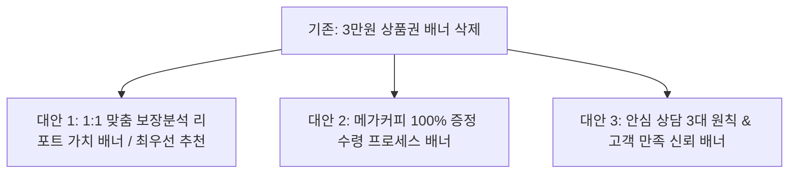

# 📋 [전략 기획서] 메가커피 단일 혜택 전환 및 3만원 상품권 삭제 시 최적화 방안

> **문서 버전:** v1.0  
> **작성 일자:** 2026. 09. 03  
> **프로젝트:** 핀토스 보험케어 (InsureCare)  
> **핵심 과제:**  
> • '가입 시 3만원 상품권' 혜택을 전면 삭제하고  
> • **'상담 완료 시 메가커피 100% 증정' 단일 혜택** + **'전문 보장 분석 케어'** 중심으로 사이트를 개편할 때의 최적 설계안 수립

---

## 1. 개편 배경 및 3만원 상품권 삭제의 장점

### 1.1 왜 3만원 상품권을 삭제하는 것이 유리한가?

| 비교 항목 | 3만원 상품권 유지 시 | 3만원 상품권 삭제 & 메가커피 단일화 시 |
| :--- | :--- | :--- |
| **광고심의 안정성** | • 보험업법 제98조(특별이익 3만원 한도) 및 가입 조건부 경품 규제 리스크 상존 | • **순수 상담 답례품(커피 약 4,500원 상당)으로 분류되어 심의 승인이 가장 빠르고 안전** |
| **고객 민원/분쟁** | • "가입했는데 상품권 언제 주나요?" 등 조건 미충족 시 불만 민원 발생 가능 | • 상담 완료 즉시 커피 발송으로 **고객 신뢰도 및 만족도 100% 확보** |
| **체리피커 필터링** | • 고액 상품권만 노리고 허위 가입하려는 악성 DB 유입 가능성 | • 가벼운 커피 혜택으로 진입 허들은 낮추되, **진짜 보험 점검이 필요한 고객 중심 유입** |
| **메시지 집중도** | • 커피 vs 상품권 간의 혜택 분산으로 방문자 인지 피로도 발생 | • **"상담받고 시원한 커피 한잔 + 내 보험 완벽 점검"**으로 메시지 일원화 |

---

## 2. 3만원 상품권 삭제 시 하단 배너(`promo_banner.jpg`) 최적 대체 방안

기존 3만원 상품권 배너 자리를 어떻게 채우는 것이 전환율과 신뢰도를 가장 높일 수 있는지 3가지 최적 대안을 제시합니다.



---

### 🌟 [대안 1: 최우선 추천] "30개 보험사 정밀 비교 리포트 무료 발급" 가치 배너로 대체

경품 대신 **"내가 받을 수 있는 전문적인 서비스의 가치"**를 시각화하여 프리미엄 전문성을 강조합니다.

- **배너 콘셉트:** 귀여운 동물 캐릭터들이 각각 '보장 분석서', '숨은 보험금 찾기', '약관 정밀 대조' 서류를 들고 있는 **전문가 안심 리포트 배너**.
- **메인 카피:**  
  > **`"내게 꼭 맞는 보장만 쏙쏙!"`**  
  > **`30개 주요 보험사 정밀 비교 리포트를 무료로 제공해 드립니다.`**
- **서브 카피:**  
  `중복된 특약 정비부터 숨은 보험금 찾기까지, 나만의 1:1 맞춤 케어 솔루션`
- **장점:**  
  1. 심의 규정에 100% 안전 (금전적 보상이 아닌 순수 전문 서비스 제공).
  2. 단순 상담 신청이 아닌 **"고급 리포트를 무료로 신청하는 경험"**으로 전환율 극대화.

---

### ☕ [대안 2] "메가커피 웰컴 기프티콘 3단계 간편 수령" 배너로 일원화

상단과 하단의 혜택 메시지를 '메가커피 100% 증정' 하나로 통일하고, 수령 방법을 직관적으로 안내합니다.

- **배너 콘셉트:** 메가커피 아이스 아메리카노와 스마트폰 카카오톡 알림톡 수령 화면 일러스트.
- **메인 카피:**  
  > **`"상담 완료 후 즉시 카톡 발송!"`**  
  > **`보드미가 준비한 시원한 메가커피와 함께 편안한 상담을 받아보세요.`**
- **서브 프로세스:**  
  `① 상담 신청서 작성 ➔ ② 전문 상담원 1:1 안심 상담 ➔ ③ 메가커피 모바일 쿠폰 즉시 전송!`
- **장점:** 신청 후 리워드 지급에 대한 신뢰감을 높여 폼 작성 완료율 상승.

---

### 🛡️ [대안 3] "보드미 3대 안심 상담 약속" 신뢰 보증 배너

보험 상담에 대한 일반적인 거부감(강요, 불필요한 권유, 개인정보 유출)을 해소하는 안심 약속 배너.

- **배너 콘셉트:** 방패(ShieldCheck), 악수(Handshake), 서류 아이콘과 캐릭터들.
- **메인 카피:**  
  > **`"부담 없는 안심 상담을 약속합니다"`**
- **3대 안심 원칙:**  
  1. ❌ **가입 강요 절대 없음** (순수 객관적 보장 분석만 진행)  
  2. 🔒 **개인정보 철저 보안** (상담 목적 외 일체 사용 금지)  
  3. 📑 **생·손보 전 보험사 객관적 비교** (특정 보험사 편향 없는 투명한 분석)

---

## 3. 사이트 전체 화면 흐름 및 UX 재설계 (개편 구조)

3만원 상품권이 삭제된 후의 깔끔하고 군더더기 없는 원페이지 퍼널 구조입니다.

```
┌────────────────────────────────────────────────────────┐
│ [ 상단 히어로 영역 ]                                   │
│  - "내 보험료는 적정할까? 3분 객관적 보장 진단"         │
└────────────────────────────────────────────────────────┘
                           ↓
┌────────────────────────────────────────────────────────┐
│ [ ☕ 웰컴 혜택 띠배너 ]                                 │
│  - "상담 완료 시 메가커피 아이스 아메리카노 100% 증정!" │
└────────────────────────────────────────────────────────┘
                           ↓
┌────────────────────────────────────────────────────────┐
│ [ 📋 실시간 간편 상담 신청 폼 ]                        │
│  - 4대 서비스 선택 + 상령일 계산기                     │
└────────────────────────────────────────────────────────┘
                           ↓
┌────────────────────────────────────────────────────────┐
│ [ 📊 하단 배너: 1:1 맞춤 비교 리포트 가치 제안 ] (NEW) │
│  - "30개 보험사 정밀 비교 리포트 무료 발급"            │
└────────────────────────────────────────────────────────┘
                           ↓
┌────────────────────────────────────────────────────────┐
│ [ 🤔 왜 보장분석이 필요한가? (Before/After) ]          │
│  - 중복 보장 정비, 합리적인 보장 재구성 예시 플랜     │
└────────────────────────────────────────────────────────┘
                           ↓
┌────────────────────────────────────────────────────────┐
│ [ 💬 카카오톡 실시간 안심 상담 배너 ]                   │
└────────────────────────────────────────────────────────┘
                           ↓
┌────────────────────────────────────────────────────────┐
│ [ ⚖️ 법정 필수안내사항 및 4대 표준 경고문구 박스 ]     │
└────────────────────────────────────────────────────────┘
```

---

## 4. 컴포넌트별 세부 수정 계획 (Before vs After)

| 영역 / 파일 | 수정 전 (Before) | 수정 후 (After) | 수정 효과 |
| :--- | :--- | :--- | :--- |
| **하단 배너 영역**<br>(`src/App.tsx` L1060~1065) | ``<br>*(3만원 상품권 이미지)* | **[대안 1 적용]**<br>`` | 3만원 경품 완전히 삭제 및 전문 리포트 가치 제공으로 교체 |
| **상단 배너 영역**<br>(`src/App.tsx` L578~584) | `src="/coffee_event_banner.jpg"`<br>*(메가커피 증정)* | **유지 및 톤앤매너 강화**<br>*(상담 완료 시 100% 증정 단일 웰컴 혜택으로 강조)* | 혜택 인지 구조 단순화 |
| **폼 서브 안내 문구**<br>(`src/App.tsx` L596) | `...합리적인 구성을 찾기 위해 필요한 정보를 입력해 주세요.` | `...상담 완료 시 시원한 메가커피 쿠폰과 1:1 맞춤 보장 분석 리포트를 드립니다.` | 신청 동기 부여 강화 |
| **정적 에셋 파일**<br>(`public/`) | `public/promo_banner.jpg` (3만원 상품권) | **`public/report_banner.jpg` (신규 전문 리포트 배너 생성)** | 광고심의 완벽 준수 |

---

## 5. 결론 및 제안

1. **최적의 조합:**  
   **`[상담 혜택: 메가커피 100% 증정]` + `[서비스 가치: 30개사 비교 리포트 무료 제공]`**
2. **기대 효과:**  
   - 3만원 상품권 관련 심의/민원 리스크 **0% 달성**.
   - 고객에게 "가입 강요 없이 전문 분석 리포트와 커피를 선물받는다"는 긍정적 인식 전달.
   - 체리피커 유입을 줄이고 진성 상담 전환율 극대화.

---

### 🚀 다음 진행 단계
위 **대안 1(전문 비교 리포트 배너 교체)**이 마음에 드신다면:
1. Gemini AI를 통해 3만원 상품권 배너를 대체할 **"30개 보험사 맞춤 비교 리포트 안내 배너 (`report_banner.jpg`)"**를 즉시 생성하고,
2. `src/App.tsx`의 하단 배너를 교체하여 사이트에 바로 적용해 드리겠습니다.
