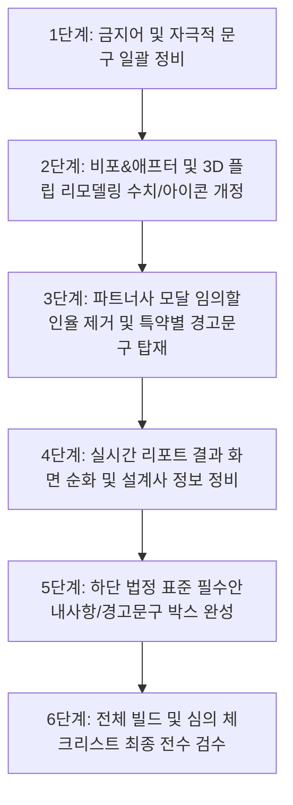

# 📋 심플컨설트 광고심의 준수 및 리뉴얼 수정 기획서

> **기준 문서:** 프라임에셋/생·손보협회 [업무광고 광고심의 작성 참고자료 (26.05.21)]  
> **대상 프로젝트:** 심플컨설트 (SimpleConsult / 핀토스 보험케어)  
> **광고 유형:** 보험대리점(GA) 온라인 업무광고 (랜딩페이지 / 바이럴)  
> **작성 일자:** 2026. 08. 18

---

## 1. 개요 및 심의 기본 방향

### 1.1 배경 및 목적
본 프로젝트는 고객 맞춤형 보장 분석 및 상담 신청을 중개하는 보험대리점(GA)의 온라인 업무광고 랜딩페이지입니다. 보험업법 및 생명·손해보험협회의 광고심의 규정에 부합하지 않는 표현이나 필수 고지사항 누락이 발생할 경우, **심의 반려, 과태료 부과, 게시 중단 등의 리스크**가 발생할 수 있습니다.  
따라서 본 기획서는 심의 참고자료(26.05.21)를 엄격히 준수하여 **위반 소지 요소를 전면 배제하고 법정 필수 안내사항을 완벽히 갖춘 상태로 수정**하는 것을 목표로 합니다.

### 1.2 핵심 준수 4대 원칙
1. **필수안내사항 표준화 (`1항`)**
   - 대리점명, 모집종사자(설계사) 성명, 손·생보협회 등록번호, 심의필 번호, 유효기간(시작일~종료일 명시, 1년 준수 문구)의 표준 배치.
2. **금지 표현 및 오인 유발 행위 전면 배제 (`4항`)**
   - 단정적 표현(`최고`, `무조건`, `100%`, `최저`), 과장/자극적 표현(`누수`, `누출`, `폭탄`, `한방에`), 직판/다이렉트 오인 표현(`다이렉트`, `온라인보험`), 보장성 상품의 저축성 오인(`수익`, `비축`, `원금회수`), 화폐 기호 및 코인/지폐 이미지 제거.
3. **보험 리모델링 및 비교 표현의 객관화 (`4.⑤항`)**
   - '보험료 절감/세이브' 등의 단정적 표현을 지양하고, *"불필요하거나 중복된 보장은 줄여서 효율적인 지출을 도와주는"* 합리적 표현으로 전환.
   - 가입설계 및 보험료 예시 노출 시 산출기준(나이, 성별, 직업급수, 납기, 만기) 명시.
4. **법정 필수 경고문구의 색상 차별화 및 원문 준수 (`2항`)**
   - 해지 후 재계약 불이익, 개인의견 고지, 약관참조 안내, 보험료 변동가능성 고지, 실손의료비 자기부담금 고지, 운전자보험 12대 중과실 면책 고지 등을 축약/변형 없이 배치.

---

## 2. 심의 위반 항목별 정밀 진단 및 개선 방향

| 분류 | 관련 조항 | 현행 코드/UI 위반 요소 | 개선 및 수정 방향 |
| :--- | :--- | :--- | :--- |
| **필수안내사항** | `1항` | • 푸터에 가상의 임의 심의필 기재<br>• 설계사명 및 협회등록번호 미비 | • 법정 표준 필수안내사항 박스 적용<br>• `설계사 OOO (손·생보 협회 등록번호 00000000000000)` 형식 명시 |
| **단정·과장 표현** | `4.⑥항` | • "100% 무조건 이득"<br>• "월 보장비용 최대 35% 즉시 다운"<br>• "동종업계 평균 할인율 최대 -15%" | • 단정적 수치 및 극단적 표현 전면 삭제<br>• 합리적/실속 있는 조정 권장 문구로 순화 |
| **보험료 절감 오인** | `4.⑤항`<br>`4.⑭항` | • "318,050원 절감 (-66.2%)"<br>• "매월 세이브 가능한 가계소득"<br>• "월 6.5만원 절감 가능액" | • 절감 단정 문구 삭제<br>• "보장 재구성 예시 플랜"으로 변경 및 산출기준 명시 |
| **화폐 및 자극적 UI** | `4.⑦항` | • `<Coins />` 코인 아이콘 노출<br>• "새는 보험료", "누수 특약" 등의 자극적 단어 | • 코인/화폐 아이콘 제거 (`<ShieldCheck>`, `<Check>` 등으로 교체)<br>• "중복/불필요 보장 점검"으로 순화 |
| **직판(다이렉트) 오인** | `4.④항` | • "다이렉트 안심실손보험"<br>• "종합 다이렉트 솔루션" | • 대리점 비교 서비스이므로 '다이렉트' 단어 완전 제거<br>• '실손의료비보험' 등 정식 명칭 사용 |
| **보장성 상품 왜곡** | `4.⑧항` | • "가계 회생 추천액", "연간 비축 가능"<br>• "자산 안정을 잡았습니다" | • 저축/수익성으로 오인될 수 있는 표현 삭제<br>• 보장 공백 보완 및 합리적 구성 중심의 문구로 변경 |
| **특약별 경고문구** | `2.1항` | • 실손보험 자기부담금 고지 누락<br>• 운전자보험 12대 중과실 면책 고지 누락 | • 실손/운전자/해지환급금 관련 표준 경고문구 상시 노출 |
| **허위 직급 및 인증** | `4.⑯항`<br>`11항` | • "★ 우수품질인증 (2024~2026)"<br>• "고객만족율 98%" (증빙 미비) | • 미증빙 임의 배지 전면 삭제<br>• 우수인증설계사 적용 시 인증번호 및 증빙자료 첨부 규격 준수 |

---

## 3. 컴포넌트별 상세 수정 계획 (Before vs After)

---

### 3.1 메타데이터 및 타이틀 (`index.html`)

| 파일 / 위치 | 수정 전 (Before) | 수정 후 (After) | 심의 근거 |
| :--- | :--- | :--- | :--- |
| `index.html`<br>L13, L20 | `나도 모르게 새는 보험료가 없는지 확인하세요! 숨은 보험금 찾기부터 최적화 리모델링까지 보드미 AI 리포트가 함께합니다.` | `불필요하거나 중복된 보장은 없는지 꼼꼼하게 점검해 보세요. 객관적인 보장 분석과 맞춤 상담을 제공합니다.` | `4.⑦` 자극적 표현("새는 보험료") 지양 |

---

### 3.2 메인 히어로 & 상담 폼 (`src/App.tsx`)

| 위치 / 코드 라인 | 수정 전 (Before) | 수정 후 (After) | 심의 근거 |
| :--- | :--- | :--- | :--- |
| **Hero 서브 카피**<br>(L595) | `가계 소중한 생활 소득을 지키는 3분 리밸런싱 예약을 위해 필수 세부 정보를 입력해 주세요.` | `현재 가입된 보장을 종합적으로 점검하고 합리적인 구성을 찾기 위해 필요한 정보를 입력해 주세요.` | `4.⑤` 절감 오인 완화 |
| **상령일 계산 하단**<br>(L728 부근) | `...보험 나이는 38세이며 다음 상령일까지 45일 남았습니다.` *(경고문구 없음)* | `...보험 나이는 38세이며 다음 상령일까지 45일 남았습니다.`<br>`<p className="text-[11px] text-neutral-400 mt-1">※ 보험회사 상품별, 성별, 연령, 직업 등에 따라 가입가능한 담보와 가입금액, 보험료 등은 달라질 수 있습니다.</p>` | `2.1` 보험료 변동가능성 필수 고지 |
| **필요성 섹션**<br>(L1071, L1094) | • `매달 자동이체되는 상당한 규모의 보험금을 제대로 보장받고 안전하게 줄이는 방법을 알아봅니다.`<br>• `생보사 및 손보사 전체 약관을 대조해 같은 지급 대비 부담을 최소한으로 고착` | • `현재 보유 중인 보험의 보장 범위와 구성을 객관적으로 점검하여 효율적인 유지 관리를 돕습니다.`<br>• `주요 생·손보사 보장 조건을 꼼꼼히 대조하여 고객 맞춤형 최적 플랜을 안내합니다.` | `4.⑤` 리모델링 절감 오인 지양 |

---

### 3.3 비포 & 애프터 비교 섹션 (`src/components/BeforeAfterSection.tsx`)

가장 핵심적인 수정 대상 컴포넌트입니다.

| 항목 | 수정 전 (Before) | 수정 후 (After) | 심의 근거 |
| :--- | :--- | :--- | :--- |
| **아이콘** | `<Coins size={14} />` (동전 아이콘) | `<Sparkles size={14} />` 또는 `<Check size={14} />` | `4.⑦` 화폐/동전 이미지 노출 금지 |
| **항목 배지** | `중복 가입 누수`, `원금 손실` | `중복 가입 점검`, `보장 구조 점검` | `4.⑦` 자극적/공포 유발 표현 순화 |
| **절감액 배너**<br>(L136~142) | `매월 세이브 가능한 가계소득`<br>**`318,050원 절감 (-66.2%)`** (바운스 애니메이션) | `보장 재구성 예시 플랜`<br>**`중복 보장 조정 및 필수 보장 집중`** | `4.⑤` 리모델링 절감 단정 금지 |
| **결과 요약 문구**<br>(L173) | `...매월 약 31만원 상당의 보험료를 절감하면서 필요한 핵심 보장은 든든하게 점검해 드렸습니다!` | `...중복된 특약과 불필요한 보장을 정비하여 꼭 필요한 핵심 보장 중심으로 균형 있게 재구성하였습니다.` | `4.⑤` 절감 확정 오인 금지 |
| **산출기준 표기**<br>*(신규 추가)* | *미표기 상태* | `<p className="text-[10px] text-neutral-400 text-left pt-2">※ [산출기준 예시] 38세 남성, 상해 1급, 20년납 100세만기 기준 (개인의 연령, 성별, 직업, 병력에 따라 가입 조건 및 보험료는 달라질 수 있습니다.)</p>` | `4.⑭` 보험료 안내 시 산출기준 명시 |
| **필수 경고문구 박스**<br>*(하단 추가)* | *미표기 상태* | **[가입 전 유의사항 경고문구 박스 삽입]**<br>• 기존 계약 해지 및 신규 체결 시 불이익 고지<br>• 약관 참조 안내<br>• 모집종사자 개인 의견 및 손익 귀속 안내 | `2.1` 공통 필수 경고문구 |

---

### 3.4 3D 대시보드 플립 섹션 (`src/App.tsx` L1120~1275)

| 영역 | 수정 전 (Before) | 수정 후 (After) | 심의 근거 |
| :--- | :--- | :--- | :--- |
| **차트 타이틀** | `보험료 다이어트 결과` | `보장 분석 및 조정 예시` | `4.⑤` 다이어트/절감 오인 지양 |
| **금액 비교 바** | `현재 납입액 185,000원`<br>`보드미 추천액 120,000원 (▼ 6.5만)` | `기존 설계 구성 (총 5건)`<br>`보장 재구성 플랜 (총 3건)` | `4.①`, `4.⑭` 산출기준 없는 금액 직접 비교 금지 |
| **카드 배지** | `절감 가능액 / 월 6.5만원` | `보장 정비 / 2개 영역 보강` | `4.⑤` 절감액 단정 금지 |
| **AI 제안 카피** | `보장 범위는 넓히고, 보험료는 가볍게!` | `불필요한 중복은 줄이고, 꼭 필요한 보장은 든든하게!` | `4.⑥` 과장 표현 순화 |

---

### 3.5 파트너사 & 상품 모달 (`src/components/PartnerProductModal.tsx` & `src/types.ts`)

| 항목 | 수정 전 (Before) | 수정 후 (After) | 심의 근거 |
| :--- | :--- | :--- | :--- |
| **다이렉트 명칭** | `다이렉트 안심실손보험` | `안심 실손의료비보험` | `4.④` 직판(다이렉트) 비교 오인 금지 |
| **할인율 표기** | `동종업계 평균 할인율 최대 -15%` | *해당 블록 삭제* (대신 `주요 보장 특징` 안내로 대체) | `4.⑥` 근거 없는 할인율 표기 금지 |
| **평균 금액 표기** | `예상 성인 평균 금액 48,000원` | *해당 블록 삭제* (상세 상담 시 맞춤 산출 안내) | `4.⑭` 산출기준 없는 임의 보험료 노출 금지 |
| **특약별 경고문구**<br>*(모달 하단 추가)* | *단순 문구만 존재* | • 실손보험: `실비보험은 자기부담금을 제외한 금액을 보장하는 보험입니다. (실손의료비보험은 가입시기별로 보상한도/보장범위/면책사항 등이 다를 수 있습니다.)`<br>• 운전자보험: `12대 중과실 중 무면허, 음주운전 및 뺑소니 사고는 보장에서 제외됩니다.` | `2.1` 특약별 필수 경고문구 |

---

### 3.6 프로세스 안내 섹션 (`src/components/ProcessSection.tsx`)

| 스텝 | 수정 전 (Before) | 수정 후 (After) | 심의 근거 |
| :--- | :--- | :--- | :--- |
| **STEP 2** | `특약 중복성, 과잉 적립, 납입액 누더기 지수 평가` | `보장 중복 여부, 적립보험료 비중, 주요 보장 공백 정밀 분석` | `4.⑦` 자극적/비방 표현("누더기 지수") 금지 |
| **STEP 4** | `매월 세이브 가능한 가계 소득 리스트 증명서 제공` | `고객 맞춤형 보장 분석 및 재구성 포트폴리오 리포트 제공` | `4.⑤`, `4.⑧` 소득 세이브/저축성 오인 지양 |
| **STEP 3** | `불편한 내방 없이 100% 무상 유선 클리닉`<br>`의무 가입 등으로 꽁꽁 숨겨진 누수 특약 공개` | `편리한 비대면 1:1 맞춤 상담 지원`<br>`중복 가입되거나 불필요한 특약을 분석하여 효율적 구성 제안` | `4.⑥` "100% 무상", `4.⑦` 자극적 표현 순화 |

---

### 3.7 실시간 진단 리포트 결과 (`src/components/DiagnosticsReport.tsx`)

| 항목 | 수정 전 (Before) | 수정 후 (After) | 심의 근거 |
| :--- | :--- | :--- | :--- |
| **세이빙스 카드** | `진단 기준 가계 회생 추천액`<br>**`월 135,000원 주택세이브 / 연간 1,620,000원 비축 가능`** | `보장 분석 점검 항목`<br>**`중복 및 보강 필요 항목 총 2건 발견`** | `4.⑤`, `4.⑧` 가계회생/비축 등 과장 수치 배제 |
| **단정적 문구** | `소멸형 저비용 상품으로 조정 후 남은 돈을 셀프 저축하는 구조가 100% 무조건 이득입니다.` | `소멸성 보장 중심 설계와 적립 보험료 비중을 비교 검토하여 합리적인 선택을 돕습니다.` | `4.⑥` "100% 무조건 이득" 단정 금지 |
| **다이렉트 다운 문구** | `기존 대형사 대위 청약 구조를 다이렉트 무해지 통합 패키지로 재조합할 경우, 동일 수령 조건 기준 월 보장 비용을 최대 35% 즉시 다운시킬 수 있습니다.` | `불필요한 특약을 정비하고 무해지 환급형 플랜을 적절히 활용하면 동일 보장 대비 보험료 부담을 합리적으로 조정할 수 있습니다.` | `4.④` 다이렉트 오인,<br>`4.⑥` 최대 35% 다운 과장 금지 |
| **설계사 매칭 배지** | `★ 우수품질인증 (2024~2026)`<br>`고객만족율 98%` | *미증빙 배지 삭제*<br>`설계사 민인환 (손·생보 협회 등록번호: 제2012118012호)` | `4.⑯`, `11` 허위/미증빙 인증 표기 금지 |

---

### 3.8 준법 고지사항 및 푸터 (`src/App.tsx` L1503~1540)

표준 업무광고 준법 필수안내사항 규격으로 전면 개편합니다.

```html
<!-- [법정 필수안내사항 표준 규격 박스] -->
<section className="bg-slate-900 text-slate-300 p-6 font-sans text-xs border-t border-slate-800">
  <div className="max-w-[768px] mx-auto space-y-3">
    <div className="border border-slate-700 bg-slate-950/60 p-4 rounded-xl space-y-2">
      <p className="font-extrabold text-white text-sm">【 필수 안내 사항 】</p>
      <div className="text-slate-300 text-xs space-y-1">
        <p>• <strong>대리점 및 모집종사자:</strong> (주)프라임에셋 보험대리점 / 설계사 OOO (손·생보 협회 등록번호: 00000000000000)</p>
        <p>• <strong>심의필 번호:</strong> 프라임에셋 심의필 제00000호 (2026.00.00 ~ 2027.00.00)</p>
        <p className="text-amber-300 font-medium">• <strong>심의 준수 및 유효기간:</strong> 본 광고는 광고심의기준을 준수하였으며, 유효기간은 심의일로부터 1년입니다.</p>
      </div>
      
      <div className="pt-3 border-t border-slate-800 text-[11px] text-slate-400 space-y-1.5 leading-relaxed">
        <p>• <strong>[해지 및 재계약 시 불이익]</strong> 보험계약자가 기존 보험계약을 해지하고 새로운 보험계약을 체결하는 과정에서 ① 질병이력, 연령증가 등으로 가입이 거절되거나 보험료가 인상될 수 있습니다. ② 가입 상품에 따라 새로운 면책기간 적용 및 보장 제한 등 기타 불이익이 발생할 수 있습니다.</p>
        <p>• <strong>[개인의견 고지]</strong> 본 내용은 모집종사자 개인의 의견이며, 계약 체결에 따른 이익 또는 손실은 보험계약자 등에게 귀속됩니다.</p>
        <p>• <strong>[약관 참조 안내]</strong> 보험사 및 상품별로 상이할 수 있으므로, 관련한 세부사항은 반드시 해당 약관을 참조하시기 바랍니다.</p>
        <p>• <strong>[보험료 변동가능성]</strong> 보험회사 상품별, 성별, 연령, 직업 등에 따라 가입가능한 담보와 가입금액, 보험료 등은 달라질 수 있습니다.</p>
      </div>
    </div>
  </div>
</section>
```

---

## 4. 법정 필수 경고문구 전문 모음집 (글자 색상 차별화 및 원문 보존)

1. **공통 필수 경고문구 (해지 및 재체결 불이익):**
   > *"보험계약자가 기존 보험계약을 해지하고 새로운 보험계약을 체결하는 과정에서 ① 질병이력, 연령증가 등으로 가입이 거절되거나 보험료가 인상될 수 있습니다. ② 가입 상품에 따라 새로운 면책기간 적용 및 보장 제한 등 기타 불이익이 발생할 수 있습니다."*
2. **개인의견 노출 시 (추천/분석 안내 시):**
   > *"본 내용은 모집종사자 개인의 의견이며, 계약 체결에 따른 이익 또는 손실은 보험계약자 등에게 귀속됩니다."*
3. **약관 참조 안내:**
   > *"보험사 및 상품별로 상이할 수 있으므로, 관련한 세부사항은 반드시 해당 약관을 참조하시기 바랍니다."*
4. **보험료 변동 가능성 안내:**
   > *"보험회사 상품별, 성별, 연령, 직업 등에 따라 가입가능한 담보와 가입금액, 보험료 등은 달라질 수 있습니다."*
5. **실비(실손)보험 안내 시:**
   > *"실비보험은 자기부담금을 제외한 금액을 보장하는 보험입니다. (실손의료비보험은 가입시기별로 보상한도/보장범위/면책사항 등이 다를 수 있습니다)"*
6. **운전자보험 안내 시:**
   > *"12대 중과실 중 무면허, 음주운전 및 뺑소니 사고는 보장에서 제외됩니다."*
7. **무·저해지 해지환급금 안내 시:**
   > *"중도해지 시 납입한 보험료보다 환급금이 적거나 없을 수 있습니다."*

---

## 5. 단계별 코드 반영 및 검증 로드맵



1. **Phase 1: 텍스트 및 용어 정비** (`types.ts`, `index.html`, `App.tsx`)
   - `절감`, `누수`, `누출`, `다이렉트`, `100% 무조건`, `폭탄` 등 금지 키워드 일괄 교체
2. **Phase 2: 비포&애프터 및 3D 플립 비교 섹션 수정** (`BeforeAfterSection.tsx`, `App.tsx`)
   - 동전 아이콘 제거, 구체적 절감액 단정 삭제, 산출기준 및 경고문구 삽입
3. **Phase 3: 제휴사 모달 및 진단 리포트 개정** (`PartnerProductModal.tsx`, `DiagnosticsReport.tsx`)
   - 임의 할인율/보험료 삭제, 실손/운전자 필수 고지 추가, 리포트 결과 수치 현실화
4. **Phase 4: 푸터 및 필수안내사항 박스 구축** (`App.tsx`, `AgreementModal.tsx`)
   - 심의필 번호, 등록번호, 유효기간, 4대 경고문구 표준 박스 적용
5. **Phase 5: 빌드 검증 및 최종 심의 제출 준비**
   - TypeScript 컴파일 및 린트 검증, 브라우저 화면 최종 확인
