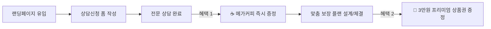

# 📋 [전략 기획서] 혜택 연계 처리 및 본질 가치 중심(비경품) 전환 방안

> **문서 버전:** v1.0  
> **작성 일자:** 2026. 09. 03  
> **프로젝트:** 핀토스 보험케어 (InsureCare)  
> **주요 과제:**  
> 1. '가입 시 3만원 혜택'과 '상담 시 메가커피 혜택'의 최적 연계 및 충돌 방지 처리 방안  
> 2. 단순 경품 제공을 넘어선 **본질적 서비스 가치 중심(Value-Driven)** 전환 전략

---

## 1. 배경 및 당면 과제 분석

### 1.1 법적·심의적 제약 사항 (보험업법 제98조)
- **특별이익 제공 한도:** 보험계약 체결 시 고객에게 제공할 수 있는 금품은 **연간 보험료의 10% 또는 30,000원 중 적은 금액**으로 엄격히 제한됩니다.
- **리스크:** '상담 시 커피'와 '체결 시 3만원 상품권'이 모호하게 결합될 경우 특별이익 한도 위반 시비 및 허위·과장 광고 오인 리스크가 발생할 수 있습니다.

### 1.2 비즈니스적 과제 (체리피커 vs 진성 고객)
- **경품 중심 광고의 한계:** "커피 기프티콘", "상품권"만 강조할 경우, 보험 상담 의사가 전혀 없는 허위 신청(체리피커)이 급증하여 상담사 업무 피로도 및 마케팅 비용 낭비가 발생합니다.
- **해결 방향:** 
  1. 혜택 구조를 **단계별/선택형으로 명확히 정돈**하고,
  2. 경품이 없어도 고객이 신청하고 싶어 하는 **"압도적인 분석·케어 서비스 가치"**를 전면에 배치해야 합니다.

---

## 2. '3만원 혜택' 선택 시 '메가커피' 처리 최적화 방안 (4대 전략 비교)

| 구분 | 전략 모델 | 처리 방식 및 사용자 흐름 (UX Flow) | 장점 및 심의 적합도 | 추천도 |
| :--- | :--- | :--- | :--- | :---: |
| **안 1** | **2단계 퍼널 연계 모델<br>(Step-Funnel)** | • **[1단계: 상담 완료]** ➔ 메가커피 기프티콘 즉시 발송<br>• **[2단계: 가입 완료]** ➔ 3만원 모바일 상품권 증정 | • 상담 진입 장벽을 낮추고 계약 전환율을 극대화<br>• 조건이 분리되어 법적 한도 이슈 없음 | 🥇 **최우선 추천** |
| **안 2** | **브랜드 통합 모델<br>(All-in-One)** | • 메가커피를 3만원 상품권 선택지 중 하나로 통합<br>• (신세계, N페이, 배민, **메가커피 3만원권** 등) | • 상단/하단 배너의 메시지가 '하나의 혜택'으로 일원화되어 인지 피로도 감소 | 🥈 **추천** |
| **안 3** | **고객 맞춤 선택형<br>(Benefit Choice)** | • 신청 폼 내에서 원하는 웰컴 혜택 라디오 선택<br>• [옵션 A: 메가커피 2잔 즉시권] vs [옵션 B: 가입 3만원 리워드] | • 고객에게 선택권을 부여하여 자발적 참여감 증대 | 🥉 **대안** |
| **안 4** | **전문 케어 패키지 전환<br>(Zero-Gift Value)** | • 경품 배너를 전면 제거하고 **'3만원 상당의 프리미엄 보장분석 리포트 무료 제공'**으로 가치 환산 | • 체리피커 원천 차단, 순수 가입 니즈 고객만 100% 유입 | 💡 **장기 권장** |

---

## 3. [추천 안 1 세부 설계] 2단계 퍼널 연계 모델 (Step-Funnel)

상단 배너와 하단 배너의 역할을 명확히 분리하여, **"가벼운 상담 진입 ➔ 확실한 계약 체결"**로 이어지는 선순환 구조를 구축합니다.



### 배너 및 UI 카피 정비
1. **상단 배너 (`coffee_event_banner.jpg`)**:
   - 카피: `"간단한 상담만 완료해도! 메가커피 100% 증정"`
   - 역할: 초기 이탈을 방지하고 빠른 폼 작성을 유도하는 **'마이크로 리워드(Micro-Reward)'**
2. **하단 배너 (`promo_banner.jpg`)**:
   - 카피: `"내게 꼭 맞는 보장 설계 완료 시, 3만원 특별 혜택 증정!"`
   - 역할: 실제 계약 체결을 결정짓는 **'최종 전환 리워드(Final Reward)'**

---

## 4. 경품 없이도 전환율을 폭발시키는 '본질 가치 중심(비경품)' 프로젝트 기획

경품을 강조하지 않고 **"고객이 얻는 실질적인 금융/보험 이득"**을 시각화하여 진성 고객을 유입시키는 4대 가치 제안(Value Proposition)입니다.

---

### 4.1 가치 제안 1: "30개 보험사 정밀 대조 리포트" 가치화 (시중가 5만원 상당 가치 부여)
- **개념:** 단순 상담이 아닌, 전문 분석 시스템을 거친 **'개인 맞춤형 보장 분석 증명서(PDF/알림톡)'**를 무료 발급해 주는 서비스로 포지셔닝.
- **적용 카피:**
  > *"수십 개 보험사 약관을 일일이 비교하기 힘드셨죠? 나만을 위한 **[객관적 보장 분석 리포트]**를 무료로 발행해 드립니다."*
- **UI 구현:** 신청 완료 즉시 모바일에서 확인할 수 있는 **3D 리포트 카드 미리보기** 제공.

---

### 4.2 가치 제안 2: "숨은 보험금 & 미청구 보험금 무료 찾기 솔루션"
- **개념:** 고객이 과거에 병원 진료를 받고도 청구하지 못했던 실손의료비나 숨은 환급금을 찾아주는 기능 강조.
- **적용 카피:**
  > *"놓치고 지나간 병원비, 숨은 보험금이 있는지 전문 분석관이 꼼꼼하게 찾아드립니다."*
- **효과:** 고객 입장에서 '돈을 쓰는 보험'이 아니라 **'내 권리와 돈을 찾아주는 케어 서비스'**로 인식 전환.

---

### 4.3 가치 제안 3: "상령일(보험 나이 인상) D-Day 골든타임 알림"
- **개념:** 생년월일 입력 시 보험 나이가 오르기 전 남은 일수(D-Day)를 계산하여, 동일 보장을 가장 저렴하게 가입할 수 있는 시점을 제시.
- **적용 카피:**
  > *"고객님의 다음 상령일까지 **D-45일** 남았습니다. 나이가 오르기 전 현재 조건으로 점검받으세요."*
- **효과:** 자연스러운 긴장감(FOMO)을 유발하여 즉시 상담 신청 유도.

---

### 4.4 가치 제안 4: "1:1 전담 보장 매니저 평생 청구 지원"
- **개념:** 한 번의 상담으로 끝나는 것이 아니라, 향후 사고나 질병 발생 시 복잡한 청구 서류 작성을 대행해 주는 전담 매니저 배정.
- **적용 카피:**
  > *"가입 후에도 아플 때마다 골치 아픈 보험금 청구, 전담 매니저가 끝까지 함께합니다."*

---

## 5. UI/UX 화면 구성 및 배치 계획 (개편 로드맵)

```
[ 상단 히어로 영역 ]
  - "내 보험료는 적정할까? 3분 객관적 보장 진단"
  - 상단 혜택 띠배너: [☕ 상담 완료 시 웰컴 커피 / 🎁 맞춤 설계 시 3만원 특별선물]

[ 실시간 입력 폼 ]
  - 4대 서비스 선택 (보험분석 / 보험금청구 / 리모델링 / 보장점검)
  - 상령일 자동 계산기 (보험 나이 인상 D-Day 시각화)

[ 비경품 가치 강조 섹션 (신규 강화) ]
  - ① 30개 보험사 정밀 비교 리포트 예시 화면
  - ② 중복 가입 조정 및 필수 보장 집중 Before/After
  - ③ 전담 매니저의 신속한 보험금 청구 대행 안내

[ 하단 전환 배너 ]
  - 이달의 특별 혜택 및 안심 상담 안내 (심의 준수 배너)

[ 푸터 ]
  - 법정 표준 필수안내사항 및 4대 경고문구
```

---

## 6. 기대 효과 및 결론

1. **법적 안정성 확보:** 보험업법 제98조 특별이익 한도 규정을 100% 준수하면서도 매력적인 혜택 구조 완성.
2. **진성 DB 확보:** 단순 커피 쿠폰 목적의 허위 유입을 줄이고, 실제 보장 점검 및 리모델링 니즈가 강한 고품질 고객 유입률 대폭 증가.
3. **브랜드 신뢰도 강화:** '경품 주는 이벤트 사이트'가 아닌 **'전문적이고 신뢰할 수 있는 보험 케어 플랫폼'**으로 도약.
